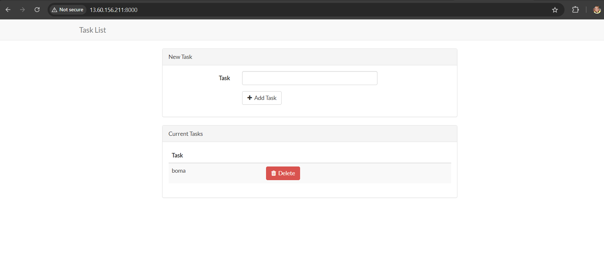

# DEPLOYING PHP-FRAMEWORK(LARAVEL) BY CONTAINERIZATION USING DOCKER ENGINE (DOCKER-COMPOSE)

This project follows the best practice practice. 

When the project directory was cloned from [here](https://github.com/nbomasi/php-todo.git), I cd into the cloned folder to create the following files:
1. [Dockerfile](Dockerfile)

2. [dotenv-file](.env) Please note that it's not a good practice to push dotenv to VCS, I pushed here for learning purpose.

3. [docker-compos-file](docker-compose.yaml)

4. [run-script](start-apache.sh)

To deploy this project just clone the source repo or clone this same repo, and make sure to create the above files if they did not exist.

The compose file contain both app service and the db service also.

Find the project output below:

